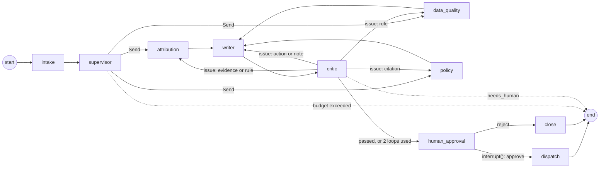

# Architecture

## Components

| Package | Role |
|---|---|
| `marketdata/` | Pandera schemas and market data controls (rules, staleness, cross-source, Isolation Forest) |
| `book/`, `pricing/`, `risk/` | Synthetic book, pricers, VaR/ES, stress, backtest, limits, VaR explain |
| `incidents/` | Injected, labeled incidents and the frozen dev/test split |
| `rag/` | Structure-aware chunking, bge-small embeddings, Weaviate retrieval |
| `agents/` | Tools, schemas, the multi-agent graph, the single-agent baseline, runtime wiring |
| `eval/` | Data-quality evaluation, agent evaluation, independent evidence checker |
| `db/` | Postgres tables: `risk_results`, `limit_status`, `dq_findings`, `tool_results` |

## Data flow

`run-daily` runs the market data controls first (their findings go to `dq_findings`), then the risk engine. It writes `risk_results`, `limit_status`, and `data/runs/<run_id>/run.json`. An alert (a limit's scope and metric on a date) starts an investigation. The agents read that run only through tools.

## Agent system

### Graph (`agents/graph.py`, SPEC §10.1)



| Node | Pattern | What it does |
|---|---|---|
| intake | deterministic | Fetches the alerted limit's status (`get_limit_status`); the breach block of the report comes from here |
| supervisor | plan and execute | Structured `Plan`: which specialists to call and one question for each |
| attribution | ReAct | Limit status, VaR explain (position vs market effect), top contributors, new trades, Greeks, stress |
| data_quality | ReAct | Data-quality findings, contributing factors, cross-source comparison (FX) |
| policy | agentic RAG (dense) | `search_policy` queries over MRLP, MDCP, Basel MAR and CRE50–55; returns citations |
| writer | structured generation | `ReportDraft` from the specialists' findings, then assembled into `IncidentReport` |
| critic | reflection | Checks 1–3 deterministic, check 4 by the LLM; sends each issue back to the agent named in it, at most 2 loops |
| human_approval | `interrupt()` | Pauses with the report; resumed with `Command(resume={decision, edits, token})` |
| dispatch | deterministic | Verifies the approval token; phase 02 writes `data/runs/<date>/escalations/<incident_id>.md` instead of sending email |

The baseline (`agents/baseline.py`) is `intake → agent → human_approval → dispatch | close`. It is one ReAct agent with every tool, the same budget, and the same `ReportDraft` step.

### Tools (`agents/tools.py`, SPEC §10.2)

`get_limit_status`, `get_risk_results`, `run_var_explain`, `get_top_contributors`, `list_new_trades`, `get_trade`, `get_greeks`, `run_stress`, `get_dq_findings`, `compare_sources`, `search_policy`. Each has a Pydantic argument schema and is deterministic. Each reads the incident's run: Postgres tables, run.json, the book override, and the market panel with its override. A `Toolbox` is bound to one incident and keeps the `run_id` hidden from the LLM, which passes dates only.

Every successful call is logged to `tool_results` under `result_id = "R" + sha256(run_id, tool, args)[:12]`, so any evidence value can be re-fetched. Per-agent allowlists are in `configs/agents.yaml`. `send_escalation_email` exists only for the dispatch node and requires an HMAC approval token keyed by `APPROVAL_SECRET`.

### Critic (`agents/critic.py`, SPEC §10.4)

1. **Evidence.** Each value is re-fetched by its `result_id`. It must match a number in that result: within a relative 1e-6, or within the rounding of the value as written, capped at 0.5%. A mismatch goes back to the specialist whose call produced the `result_id`.
2. **Citations.** Each `(doc_id, section_id)` must exist in `corpus/sections.json` and have been returned by `search_policy` in this investigation. A failure goes to policy.
3. **Rules**, from the policy's evidence requirements:
   - `position_change` needs a positive position effect (sent to attribution).
   - `bad_market_data` needs a data-quality finding on a top-3 contributing factor, and `market_move` must have none (both sent to data_quality).
   - `no_true_breach` needs utilization below 100%, and the breach causes need 100% or more (sent to attribution).
   - The action must follow the MRLP-6.7 routing table (sent to writer).
4. **Note quality.** The LLM judges clarity, prioritization, and actionability; a failure goes to the writer. It is not a reported metric.

### Guardrails (SPEC §10.8)

- Pydantic validation on every structured output, with one retry that shows the error.
- Per-agent tool allowlists: only allowlisted tools are bound, or executed if the model asks for others.
- Tool results, retrieved text, and specialist findings are wrapped in `<untrusted_data>` tags. Every system prompt says not to follow instructions inside them, and a closing tag inside the data is escaped.
- A shared per-incident budget of 60k tokens and 25 tool calls, thread-safe across the parallel branches. Exceeding it ends the run with status `needs_human`.
- No dispatch without a valid approval token.

### Runtime (`agents/runner.py`)

- The model runs at temperature 0. By default it is a Gemini Flash model on the Gemini API free tier, called through the OpenAI-compatible endpoint with a client-side rate limiter (ADR-012). Setting `llm.provider: bedrock` switches to `ChatBedrockConverse` (ADR-009).
- The CLI uses `PostgresSaver`, so a paused incident survives a process restart. `riskgraph investigate --incident INC-001 --variant multi` pauses; `riskgraph approve --thread <id> --decision approve|reject [--edits note.md]` resumes it. The evaluation uses an in-memory checkpointer.
- Langfuse tracing turns on when `LANGFUSE_PUBLIC_KEY` and `LANGFUSE_SECRET_KEY` are set. Traces are tagged `incident_id:`, `variant:`, and `split:`, with the thread ID as the session.

## API and dashboard (phase 03)

`src/riskgraph/api/app.py` is a FastAPI service over the same runtime the CLI uses.

| Endpoint | What it does |
|---|---|
| `POST /runs/daily` | Bearer-token protected. Runs the market data controls and the risk engine for a date (or refreshes market data and uses the panel's latest date), registers an incident per **breach**, and investigates each one in a background task |
| `GET /risk/summary?date=` | Desk VaR and ES by method, limit utilization, and the VaR backtest window |
| `GET /limits?date=` | Limit status rows for a base run |
| `GET /incidents`, `GET /incidents/{id}` | The queue, and one incident with its report, evidence (with the tool behind each value), citations, critic result, and Langfuse link |
| `POST /incidents/{id}/approve`, `/reject` | Resume the paused thread. Approval issues the HMAC dispatch token; rejection closes the incident with a reason |
| `GET /health` | Liveness plus a database check |

Incidents live in an `incidents` table owned by the API (ADR-013); the investigation's state stays in its LangGraph thread, so approve and reject resume exactly the paused run. The dashboard (`frontend/`, Next.js static export) has three pages — risk, incident queue, incident detail with the approval form — and is served by nginx, which also proxies `/api`.

## Deployment

Locally, `make up` runs the whole stack: Postgres, Weaviate, the API, and the dashboard on <http://localhost:3000>.

On AWS (SPEC §13.2, ADR-014) the same images run on one EC2 instance behind an nginx proxy that terminates TLS and requires basic auth:

```mermaid
flowchart TB
    subgraph GH[GitHub]
        A[Actions on push to main] -- OIDC role, no static keys --> ECR[(ECR: api, frontend)]
        A -- SSM Run Command --> D[deploy.sh on the host]
    end
    subgraph AWS[AWS ap-south-1]
        S[EventBridge Scheduler<br/>weekdays 18:00 IST] --> L[Lambda trigger]
        L -- "POST /api/runs/daily<br/>token from Secrets Manager" --> P
        subgraph EC2[EC2 m7i-flex.large, Elastic IP]
            P[nginx proxy<br/>TLS + basic auth] --> F[frontend nginx<br/>static export]
            F -- /api --> API[FastAPI + agents]
            API --> PG[(Postgres:<br/>results, incidents,<br/>checkpoints)]
            API --> W[(Weaviate:<br/>policy chunks)]
        end
        API -- approved note --> SES[SES email]
        API -- logs --> CW[CloudWatch Logs<br/>failed-run alarm]
        SM[Secrets Manager] -. .env at deploy .-> API
        S3[(S3: DVC data,<br/>MLflow artifacts)] -. dvc pull .-> API
    end
    U[Risk manager<br/>browser] -- HTTPS + basic auth --> P
    ECR -. docker compose pull .-> API
```

- **Images:** `Dockerfile` (API, CPU torch, the bge-small model baked in) and `frontend/Dockerfile` (node build, then nginx). `docker-compose.prod.yml` swaps in the ECR images, adds the proxy, drops the database ports, and sends logs to CloudWatch with the `awslogs` driver.
- **Secrets** never sit in the repo or the images. `infra/aws/deploy.sh` renders `.env` on the host from Secrets Manager on every deploy.
- **Scripts:** one per resource in `infra/aws/`, each printing its plan and monthly cost and changing nothing without `--apply` (`make aws-plan` shows them all). `make aws-stop` and `make aws-start` control the only meaningful running cost.
